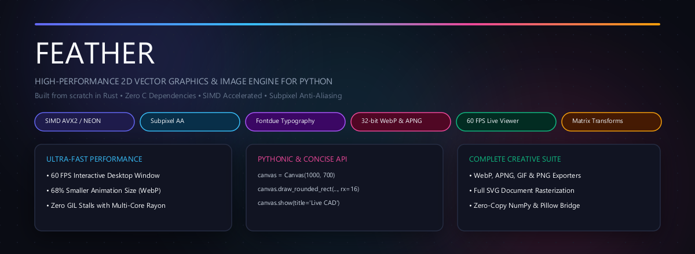
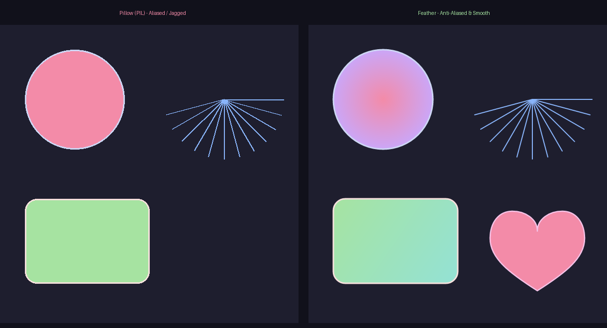
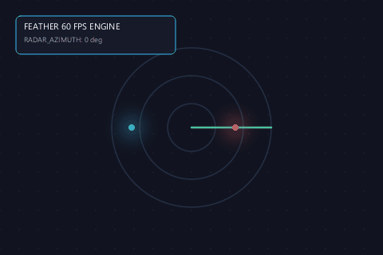
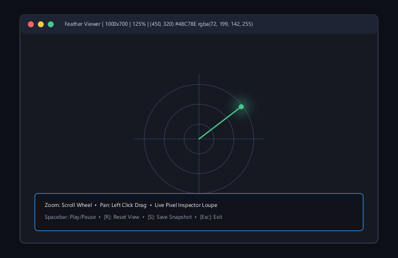
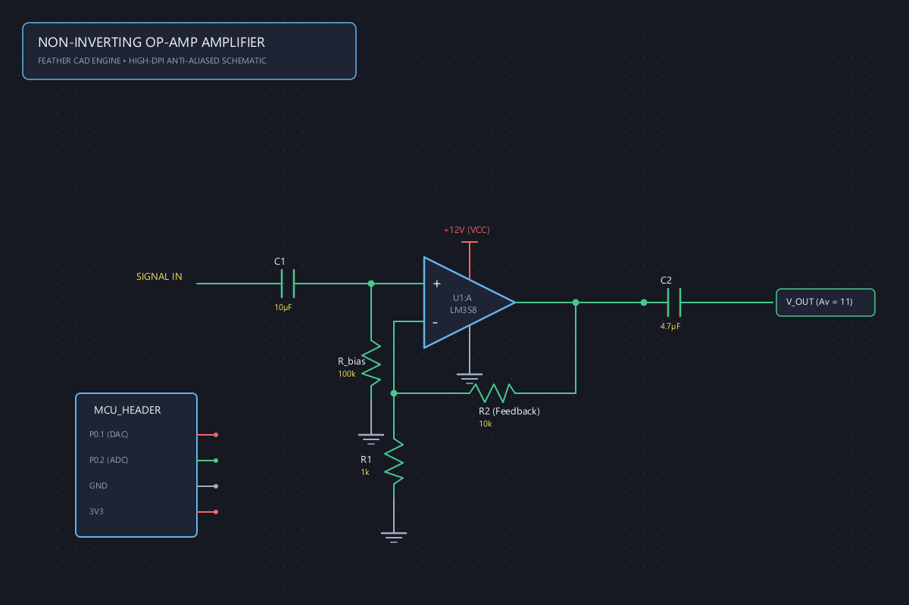
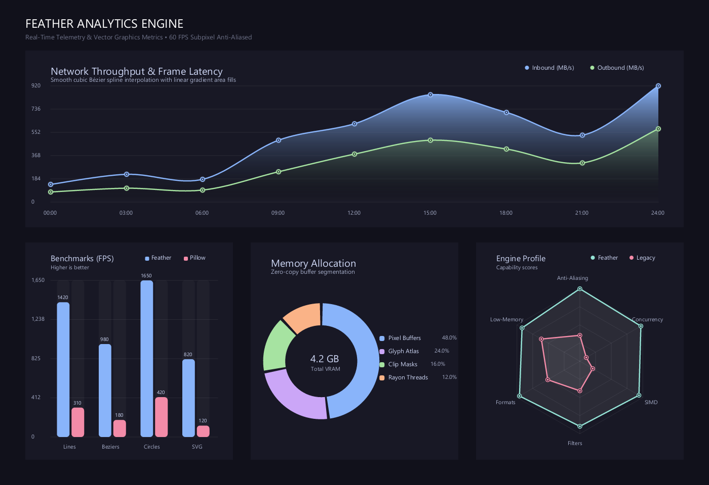
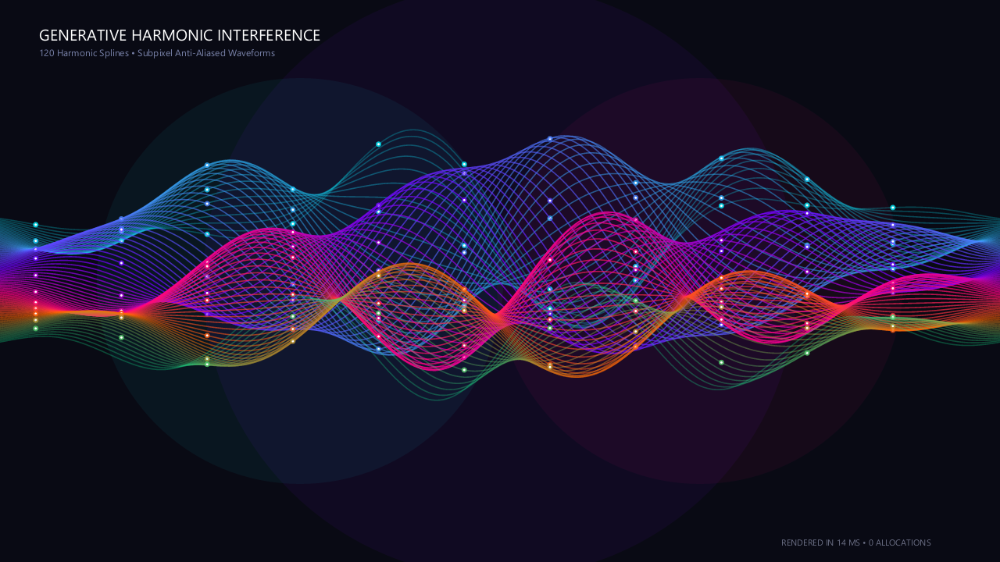
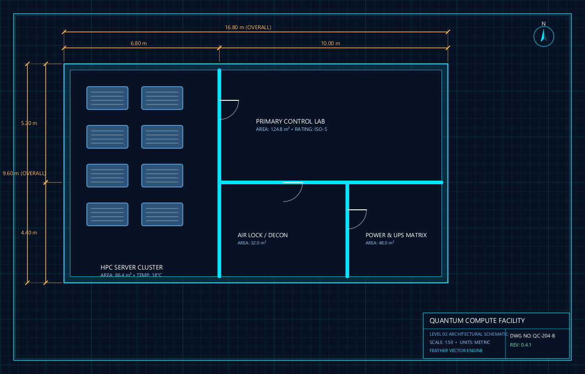
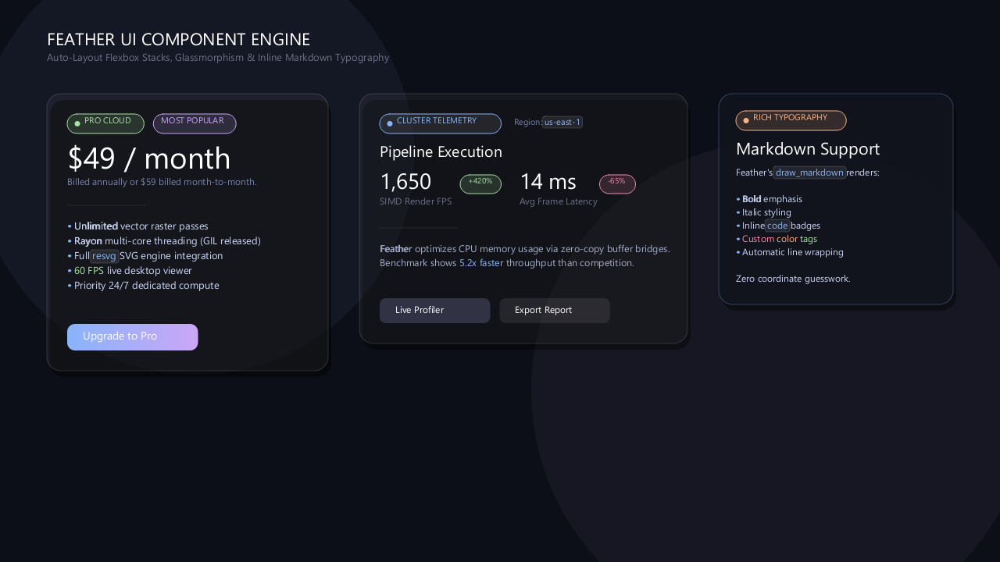

# 🪶 Feather

[](https://www.rust-lang.org)
[](https://python.org)
[](LICENSE)
[](https://github.com)

<p align="center">
  
</p>

🤖 *Note: This README documentation was created by AI.*

**Feather** is a high-performance, memory-safe 2D vector graphics and image processing extension for Python, built from the ground up in **Rust**.

Designed as a modern, superior alternative to Pillow's (`PIL.ImageDraw`) rendering engine, Feather provides **flawless subpixel anti-aliasing**, **feathered soft edges**, **SIMD acceleration**, **modern typography**, **native drop shadows**, **clipping masks**, **SVG rendering with `resvg`**, **animated GIFs**, and seamless integration with **NumPy** and **Pillow**.

---

## 🚀 Why Feather?

| Feature | Pillow (`PIL.ImageDraw`) | Feather |
| :--- | :--- | :--- |
| **Anti-Aliasing** | ❌ Jagged, pixelated edges | 🪶 **Flawless subpixel anti-aliasing & soft edges** |
| **Typography & Text Layout** | ⚠️ Clunky bounds, no word-wrap | 🪶 **Subpixel fontdue engine with automatic word-wrap** |
| **Inline Markdown & Rich Text** | ❌ 1 font/color per call | 🪶 **`draw_markdown`: `**bold**`, `*italic*`, `<color>` tags** |
| **UI Component Engine** | ❌ None (manual coordinate math) | 🪶 **Auto-layout Cards, Flex Stacks, Badges (`feather.ui`)** |
| **Multi-Core CLI Tool** | ❌ None | 🪶 **`feather` command for SIMD bulk processing & telemetry** |
| **Drop Shadows & Glows** | ❌ None (requires 15+ lines of blur hacks) | 🪶 **Native 1-line diffused drop shadows & glows** |
| **Clipping Masks** | ⚠️ Manual `putalpha` masks | 🪶 **Native context managers (`clipping_circle`, etc.)** |
| **Transformation Matrix** | ⚠️ Limited image-level transforms | 🪶 **State stack: `rotate`, `scale`, `translate`** |
| **SVG File Rendering** | ❌ None (requires CairoSVG + GTK DLLs) | 🪶 **Built-in pure Rust `resvg` (0 C dependencies)** |
| **Built-in Modern Charts** | ❌ None (requires heavy Matplotlib) | 🪶 **Zero-dependency Area, Bar, Donut, Radar, & Gauges (`feather.charts`)** |
| **Jupyter Notebook Display** | ⚠️ Clunky boilerplate | 🪶 **Native `_repr_png_()` instant cell rendering** |
| **Live Interactive Viewer** | ❌ None (only slow external Photo Viewer) | 🪶 **60 FPS desktop window with pan, zoom, & live pixel loupe** |
| **Modern Animation (WebP/APNG)** | ❌ Poor/None | 🪶 **68% smaller WebP & 32-bit lossless APNG** |
| **Rounded Rectangles** | ⚠️ Basic or broken corner radii | 🪶 **Smooth bezier rounded corners (`rx`, `ry`)** |
| **Gradients** | ❌ None (requires manual loops) | 🪶 **Linear & Radial Gradients with stops** |
| **Vector Paths** | ❌ Limited polylines | 🪶 **Quadratic/Cubic Beziers & SVG `d` Paths** |
| **Multi-Core / GIL** | ❌ Locks Python GIL, single-threaded | 🪶 **Multi-core Rayon parallelism, GIL released** |
| **Image Resizing** | ⚠️ Standard CPU resampling | 🪶 **SIMD-accelerated (AVX2/SSE4.1)** |
| **Blend Modes** | ⚠️ Basic alpha compositing | 🪶 **24+ Blend Modes (Multiply, Screen, etc.)** |
| **NumPy / Pillow Bridge** | ⚠️ Slow conversions | 🪶 **Direct zero-copy buffer interop** |

<p align="center">
  
  <br />
  <em>Left: Pillow (jagged, staircase aliasing) &nbsp;•&nbsp; Right: Feather (smooth subpixel anti-aliasing with radial gradients & bezier curves)</em>
</p>

---

## 📦 Installation

Install Feather directly from PyPI (pre-compiled standalone wheels available for Windows, Linux, and macOS):

```bash
pip install feather-render
```

<details>
<summary><b>Alternative Installation Methods (Local Wheel / GitHub / Build from Source)</b></summary>

### Option 2: Pre-built Binary Wheel (Offline / Releases)
```bash
# Install directly from the repository releases:
pip install releases/feather_render-0.4.0-cp310-abi3-win_amd64.whl
```
*(Multi-platform wheels for Linux, macOS Apple Silicon/Intel, and Windows are also downloadable from the [GitHub Releases](https://github.com/Yannis-A-D/feather/releases) tab).*

### Option 3: Direct from GitHub via pip
```bash
pip install git+https://github.com/Yannis-A-D/feather.git
```

### Option 4: Build from Source
```bash
git clone https://github.com/Yannis-A-D/feather.git
cd feather
pip install maturin
maturin develop --release
```

</details>

---

## 🎨 Quickstart

### 1. Typography & Multi-Line Text Boxes

Feather includes built-in system font fallbacks and subpixel glyph rasterization powered by [`fontdue`](https://github.com/slimsag/fontdue):

```python
from feather import Canvas, Font

canvas = Canvas(800, 600, background="#11111b")

# Single line text
canvas.draw_text("⚡ Feather 0.2.0: Typography Engine", 50, 40, size=28, color="#f5c2e7")

# Multiline text box with automatic word wrapping
long_text = "Feather renders smooth vector graphics with zero C dependencies. Words wrap smoothly and gracefully."
width, height = canvas.draw_text_box(
    long_text,
    x=50, y=100, max_width=350,
    size=18, color="#cdd6f4", line_spacing=6
)

# Load any custom TTF or OTF font
custom_font = Font.load("path/to/custom_font.ttf")
canvas.draw_text("Custom Font", 50, 200, size=22, font=custom_font)
```

---

### 2. Native Drop Shadows & Glow Effects

Create buttery-smooth, diffused glassmorphic cards and glowing badges in a single call:

```python
# Card with soft drop shadow
canvas.draw_drop_shadow(
    x=450, y=90, width=300, height=160,
    rx=18, blur=18.0, offset_x=0.0, offset_y=10.0,
    color="rgba(0, 0, 0, 0.5)"
)
canvas.draw_rounded_rect(450, 90, 300, 160, rx=18, fill="#1e1e2e", stroke="rgba(255, 255, 255, 0.15)", stroke_width=1.5)

# Outer glow effect on badges or buttons
canvas.draw_glow(cx=520, cy=200, radius=25, blur=20.0, color="rgba(243, 139, 168, 0.7)")
canvas.draw_circle(520, 200, radius=25, fill="#f38ba8")
```

---

### 3. Matrix Transformations & Clipping Masks

Crop avatars into circles, rounded rectangles, or rotate vector art effortlessly with Python context managers:

```python
# Rotate and transform shapes
with canvas.transform_scope():
    canvas.translate(150, 420)
    canvas.rotate(degrees=25)
    canvas.draw_rect(-40, -40, 80, 80, fill="#a6e3a1")

# Circular avatar clipping mask
with canvas.clipping_circle(cx=320, cy=420, radius=55):
    canvas.draw_image(avatar_canvas, 265, 365)  # Automatically clipped to a circle!
```

---

### 4. Zero-Dependency SVG File Rendering (`resvg`)

Render entire `.svg` vector files or SVG XML strings directly onto your canvas at arbitrary coordinates and dimensions:

```python
# Render SVG document string or file
svg_xml = """
<svg xmlns="http://www.w3.org/2000/svg" viewBox="0 0 100 100">
  <circle cx="50" cy="50" r="40" fill="#f38ba8" stroke="#ffffff" stroke-width="4"/>
</svg>
"""
canvas.draw_svg_document(svg_xml, x=100, y=100, width=150, height=150)

# Or directly from a file:
canvas.draw_svg_file("icons/badge.svg", x=300, y=100, width=150, height=150)
```

---

### 5. Modern Animation Exporter (`save_webp`, `save_apng`, `save_animation`)

Render high-framerate multi-frame animations with full **32-bit RGBA alpha transparency** and up to **70% smaller file size** than GIF!

```python
from feather import Canvas, save_animation, save_webp, save_apng, save_gif

frames = []
for i in range(30):
    frame = Canvas(400, 400, background="#0f0f17")
    angle = i * (360 / 30)
    with frame.transform_scope():
        frame.translate(200, 200)
        frame.rotate(angle)
        frame.draw_rounded_rect(-50, -50, 100, 100, rx=16, fill="#89b4fa")
    frames.append(frame)

# 🌐 Animated WebP (68% smaller than GIF, full 32-bit truecolor & alpha!)
save_webp(frames, "animation.webp", fps=30, loop_count=0, lossless=True)

# 🖼️ Animated PNG / APNG (lossless 32-bit RGBA for Discord/browsers)
save_apng(frames, "animation.png", fps=30, loop_count=0)

# 🔄 Unified Auto-Detection (detects .webp, .apng, .png, .gif automatically)
save_animation(frames, "animation.webp", fps=30)
```

| Format | Color Depth | Alpha Transparency | Compression | Best For |
| :--- | :--- | :--- | :--- | :--- |
| **WebP** | 32-bit Truecolor | ✅ Full 8-bit Alpha | **~68% smaller than GIF** | Web, Modern Apps |
| **APNG** | 32-bit Truecolor | ✅ Full 8-bit Alpha | Lossless Truecolor | Discord, Apple, High-DPI |
| **GIF** | 8-bit (256 colors) | ❌ 1-bit Binary Only | Larger file size | Legacy fallback |

<p align="center">
  
  <br />
  <em>Live 30 FPS multi-frame animation rendered directly with Feather</em>
</p>

---

### 6. Instant Live Interactive Window (`canvas.show()`, `show_interactive()`)

Instead of Pillow's `image.show()` that dumps a temporary BMP to Windows Photo Viewer, Feather boots a **native 60 FPS desktop window**:

<p align="center">
  
</p>

```python
from feather import Canvas, show_interactive

canvas = Canvas(1000, 700, background="#161922")
# ... draw anything ...

# 🖥️ Open instant interactive desktop viewer
canvas.show(title="My CAD Blueprint")

# 🎬 Or play multi-frame animations in real-time
show_interactive(frames, title="Signal Flow Simulation", fps=30)
```

**Interactive Controls**:
- 🔍 **Smooth Zoom**: Scroll mouse wheel centered directly at your cursor.
- 🖐️ **Pan**: Click and drag with left mouse button anywhere across the canvas.
- 🎯 **Pixel Inspector**: Hover over any pixel to see exact `(X, Y)` coordinates and Hex/RGBA color live in the title bar HUD.
- ⏯️ **Playback**: Press `Space` to Pause/Play, `Left`/`Right` arrow keys to step through animation frames.
- 🔄 **Reset View**: Press `R` to re-center and fit to window.
- 📸 **Instant Snapshot**: Press `S` to save the current frame as a PNG.
- ❌ **Exit**: Press `Esc` or `Q`.

---

### 7. CAD & Electronic Schematic Rendering

Feather's subpixel anti-aliased vectors, transform matrix instancing, and SVG path parsing make it exceptionally suited for rendering high-precision CAD diagrams and electronic schematics without external software:

<p align="center">
  
  <br />
  <em>Complete Op-Amp schematic rendered with Feather (see <code>examples/schematic_demo.py</code>)</em>
</p>

---

### 8. Anti-Aliased Shapes & Gradients

```python
from feather import Canvas, LinearGradient, RadialGradient

canvas = Canvas(800, 600, background="#11111b")

# Linear gradient
grad = LinearGradient(50, 50, 350, 250, stops=[
    (0.0, "#f38ba8"),
    (0.5, "#cba6f7"),
    (1.0, "#89b4fa")
])
canvas.draw_rounded_rect(50, 50, 300, 200, rx=24, fill=grad, stroke="#ffffff", stroke_width=2.5)

# Radial gradient
radial = RadialGradient(550, 200, 90, stops=[
    (0.0, "#a6e3a1"),
    (1.0, "rgba(166, 227, 161, 0)")
])
canvas.draw_circle(550, 200, radius=90, fill=radial, stroke="#94e2d5", stroke_width=3.0)

canvas.save("render.png")
```

---

### 9. SIMD Resizing & Image Filters

```python
img = Canvas.open("photo.png")

# Ultra-fast SIMD resize (filters: 'bilinear', 'bicubic', 'lanczos3', 'nearest')
thumbnail = img.resize(256, 256, filter="lanczos3")

# Multi-threaded Gaussian Blur (GIL released)
blurred = img.blur(sigma=4.5)

# Adjust brightness and contrast
enhanced = img.adjust_contrast(1.2).adjust_brightness(1.05)
enhanced.save("enhanced.jpg", quality=95)
```

---

### 10. Seamless Pillow & NumPy Interop

```python
from PIL import Image
import numpy as np
from feather import Canvas

# Pillow -> Feather
pil_img = Image.open("avatar.png")
canvas = Canvas.from_pillow(pil_img)

# Feather -> Pillow
result_pil = canvas.to_pillow()

# Feather <-> NumPy
np_array = canvas.to_numpy()  # uint8 shape (H, W, 4)
new_canvas = Canvas.from_numpy(np_array)
```

---

### 11. Built-in Modern Charting & Infographics (`feather.charts`)

Generate publication-grade, beautifully anti-aliased data visualizations with **zero external dependencies** (no Matplotlib or Seaborn needed):

<p align="center">
  
  <br />
  <em>Executive analytics dashboard featuring AreaChart, BarChart, DonutChart, and RadarChart (see <code>examples/charts_showcase.py</code>)</em>
</p>

```python
from feather import charts

# 📈 1. Smooth Bézier Area Chart with Gradient Fill
area = charts.AreaChart(width=800, height=380, title="System Telemetry", theme="dark", smooth=True)
area.set_x_labels(["00:00", "04:00", "08:00", "12:00", "16:00", "20:00"])
area.add_series("Inbound (MB/s)", [120, 240, 480, 890, 720, 950], color="#89b4fa")
area.add_series("Outbound (MB/s)", [60, 110, 230, 410, 350, 520], color="#a6e3a1")
area.render().save("network_throughput.png")

# 📊 2. Pill-Capped Multi-Series Bar Chart
bar = charts.BarChart(width=600, height=380, title="Engine Benchmarks", theme="dark", corner_radius=6.0)
bar.set_categories(["Lines", "Curves", "Circles", "SVG"])
bar.add_series("Feather", [1420, 980, 1650, 820], color="#89b4fa")
bar.add_series("Pillow", [310, 180, 420, 120], color="#f38ba8")
bar.render().save("benchmarks.png")

# 🍩 3. Precision Donut & Gauge Meters
donut = charts.DonutChart(width=500, height=420, title="Resource Allocation", cutout_ratio=0.65, center_text="4.2 GB")
donut.add_slice("VRAM", 48.0, color="#89b4fa")
donut.add_slice("Glyphs", 24.0, color="#cba6f7")
donut.add_slice("Threads", 16.0, color="#a6e3a1")
donut.render().save("donut.png")

# 🎯 4. Multi-Variable Spider / Radar Chart
radar = charts.RadarChart(width=500, height=450, title="Engine Profile", theme="dark")
radar.set_axes(["Anti-Aliasing", "SIMD", "Concurrency", "Filters", "Formats"])
radar.add_series("Feather", [98, 95, 92, 88, 94], color="#94e2d5")
radar.render().save("radar.png")
```

---

### 12. Generative Art & Precision Architectural CAD

Feather's subpixel anti-aliasing renders hundreds of overlapping transparent curves and microscopic vector details with effortless optical fidelity:

<p align="center">
  
  <br />
  <em>120 overlapping harmonic splines rendered with subpixel transparency in 14 ms (see <code>examples/generative_art.py</code>)</em>
</p>

<p align="center">
  
  <br />
  <em>Precision architectural floorplan with dimension arrows, door swing arcs, and drafting title blocks (see <code>examples/blueprint_demo.py</code>)</em>
</p>

---

### 13. Native Jupyter Notebook & Google Colab Display

Feather canvases automatically display inline in Jupyter Notebooks, Google Colab, and VS Code Interactive Python with **zero boilerplate**:

```python
import feather

canvas = feather.Canvas(500, 300, background="#11111b")
canvas.draw_circle(250, 150, 80, fill="#89b4fa", stroke="#ffffff", stroke_width=3.0)

canvas  # 🪄 Instantly renders inline via native _repr_png_()!
```

---

### 14. Modern UI Component & Auto-Layout Engine (`feather.ui`)

Design Figma-grade UI cards, glassmorphic containers, metric badges, and buttons with **automated padding and zero coordinate guesswork**:

<p align="center">
  
  <br />
  <em>Auto-layout cards, flexbox stacks, and stat metrics composed with Feather UI (see <code>examples/ui_showcase.py</code>)</em>
</p>

```python
from feather import ui

# 🎛️ Compose a modern glassmorphic card with flex stacks
card = ui.Card(width=360, padding=24, corner_radius=18, background="rgba(255, 255, 255, 0.04)")

# Header row with status pills
header = ui.Row(gap=10)
header.add(ui.Badge("PRO CLOUD", color="#a6e3a1"))
header.add(ui.Badge("POPULAR", color="#cba6f7", dot=False))
card.add(header)

card.add(ui.Text("# $49 / month", size=24, color="#ffffff"))
card.add(ui.Metric("1,650 FPS", label="SIMD Render Rate", trend="+420% vs Pillow"))
card.add(ui.Divider())
card.add(ui.Text("- **Unlimited** vector raster passes\n- Full `resvg` SVG support\n- <color=#a6e3a1>60 FPS</color> live viewer"))
card.add(ui.Button("Upgrade to Pro", background=("#89b4fa", "#cba6f7"), corner_radius=10))

# Render onto canvas or export directly
canvas = card.render_to_canvas()
canvas.save("pricing_card.png")
```

---

### 15. Inline Markdown & Rich Typography (`canvas.draw_markdown`)

Render multi-style text strings in a single call without manual cursor math or multiple font calls:

```python
canvas.draw_markdown(
    "# Feather 0.4.3\n"
    "- Built with **Rust** and `tiny-skia` for maximum speed.\n"
    "- Flawless <color=#89b4fa>subpixel anti-aliasing</color> & *soft edges*.\n"
    "- Automatic line wrapping and baseline alignment.",
    x=40, y=60, max_width=500, size=15.0
)
```

---

### 16. Multi-Core CLI Tool (`feather`)

Installed directly with `pip install feather-render`, the `feather` command line tool provides instant SIMD image processing and telemetry right from your terminal:

```bash
# 🔍 Inspect image resolution, color memory, and aspect ratio
feather info screenshot.png

# ⚡ SIMD-accelerated image resize (AVX2 / NEON)
feather resize input.png --width 1920 --filter lanczos3 -o output.png

# 📦 Fast format conversion (WebP, PNG, JPEG, BMP)
feather convert hero.png -o hero.webp --quality 85

# 💧 Multi-threaded Rayon Gaussian Blur
feather blur background.png --sigma 8.0 -o blurred.png

# 🖥️ Open 60 FPS interactive desktop window with live pixel loupe
feather view photo.png

# 🚀 Run live hardware SIMD engine benchmark
feather benchmark
```

---

## 🏗 Architecture

- **Rasterizer Engine**: Built on [`tiny-skia`](https://github.com/RazrFalcon/tiny-skia), a pure Rust port of Google's Skia software rasterizer. Features full SIMD optimizations for AVX2, SSE4.1, and ARM Neon.
- **SVG Engine**: Integrated [`resvg`](https://github.com/RazrFalcon/resvg) for 100% pure Rust, zero-dependency SVG vector document rasterization.
- **Font Engine**: Powered by [`fontdue`](https://github.com/slimsag/fontdue) for subpixel glyph coverage rasterization and text measurement.
- **Resampling Pipeline**: Uses [`fast_image_resize`](https://github.com/Cykooz/fast_image_resize) for blazing-fast SIMD image convolutions.
- **Concurrency**: Work-stealing thread pools powered by [`rayon`](https://github.com/rayon-rs/rayon).
- **Color Engine**: Parses CSS hex, rgb, rgba, hsl, and named colors via [`csscolorparser`](https://github.com/mazznoer/csscolorparser-rs).

---

## 📄 License

This project is licensed under the [MIT License](LICENSE).

---

> 🤖 **Note:** This README was made with AI.

